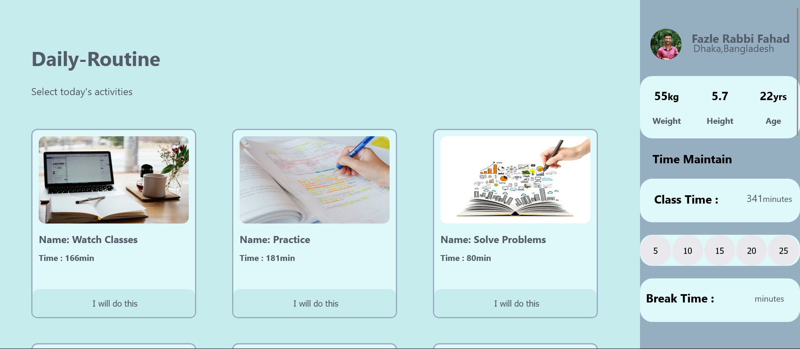

This is a responsive, fully-functional routine website. I created this whole website using React JS, CSS(DaisyUI) and HTML5. You can see my live website on: <a href="https://mydailyroutine.netlify.app/">https://mydailyroutine.netlify.app/</a> 
-> I have created my website using React JS, Tailwind CSS(DaisyUI) 
-> A wonderful and responsive UI. 
-> Used dynamic and static data 
-> User can add your daily works and break time 
-> And user can get the total time needed 
-> Used netlify to deploy 

